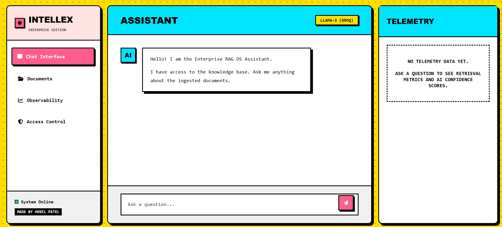

# Enterprise RAG OS

> **A Production-Ready, Agentic, Multi-Modal, Explainable RAG System with Advanced Retrieval, Evaluation, Observability, and Enterprise Features.**

[](https://www.python.org/downloads/)
[](https://fastapi.tiangolo.com)
[](LICENSE)



---

## 🏗️ Architecture

```
┌─────────────────────────────────────────────────────────────────┐
│                         API Layer                                │
│                    (FastAPI, Middleware)                          │
├─────────────────────────────────────────────────────────────────┤
│                       Service Layer                              │
│              (Business Logic, Orchestration)                     │
├─────────────────────────────────────────────────────────────────┤
│                       Domain Layer                               │
│            (Schemas, Models, Base Interfaces)                    │
├─────────────────────────────────────────────────────────────────┤
│                   Infrastructure Layer                           │
│         (Vector DBs, LLM Clients, File I/O, Cache)              │
└─────────────────────────────────────────────────────────────────┘
```

## 🚀 Quick Start

### Prerequisites

- Python 3.12+
- pip

### Installation

```bash
# Clone the repository
git clone <repository-url>
cd enterprise-rag

# Create virtual environment
python -m venv .venv
.venv\Scripts\activate      # Windows
# source .venv/bin/activate  # Linux/macOS

# Install dependencies
pip install -e ".[dev]"

# Copy environment config
copy .env.example .env

# Run the development server
uvicorn app.main:app --reload
```

### Verify Installation

```bash
# Health check
curl http://localhost:8000/health

# API docs
# Open http://localhost:8000/docs in your browser

# Run tests
pytest
```

## 📁 Project Structure

```
enterprise-rag/
├── app/                    # Application source code
│   ├── api/                # FastAPI routes and endpoints
│   ├── config/             # Configuration management
│   ├── core/               # Middleware, exceptions, lifecycle
│   ├── schemas/            # Pydantic API schemas
│   ├── models/             # Domain models
│   ├── services/           # Business logic layer
│   ├── pipelines/          # RAG pipeline orchestration
│   ├── agents/             # AI agent implementations
│   ├── retrievers/         # Document retrieval backends
│   ├── rerankers/          # Reranking models
│   ├── chunking/           # Text chunking strategies
│   ├── embeddings/         # Embedding model providers
│   ├── loaders/            # Document loaders
│   ├── parsers/            # Document parsers
│   ├── prompts/            # Prompt templates
│   ├── memory/             # Conversation memory
│   ├── vectorstores/       # Vector database backends
│   ├── evaluation/         # RAG quality evaluation
│   ├── observability/      # Tracing and monitoring
│   ├── analytics/          # Usage analytics
│   ├── logging/            # Structured logging
│   └── utils/              # Utility functions
├── tests/                  # Test suite
├── docs/                   # Documentation
├── docker/                 # Docker configurations
├── scripts/                # Utility scripts
└── notebooks/              # Jupyter notebooks
```

## 🧪 Development

```bash
# Run all tests
pytest

# Run tests without coverage
pytest --no-cov -q

# Lint
ruff check app/ tests/

# Format
ruff format app/ tests/

# Type check
mypy app/

# All quality checks
make check
```

## 🐳 Docker

```bash
# Build and run with Docker Compose
docker compose up -d

# View logs
docker compose logs -f

# Stop
docker compose down
```

## 📖 API Documentation

Once the server is running, visit:

- **Swagger UI**: http://localhost:8000/docs
- **ReDoc**: http://localhost:8000/redoc
- **OpenAPI JSON**: http://localhost:8000/openapi.json

## 🗺️ Roadmap

| Phase | Status | Description |
|-------|--------|-------------|
| Phase 1 | ✅ Complete | Project setup, architecture, configuration |
| Phase 2 | 🔲 Planned | Document ingestion, chunking, embeddings, vector DB |
| Phase 3 | 🔲 Planned | Hybrid retrieval, reranking, query understanding |
| Phase 4 | 🔲 Planned | Multi-LLM, streaming, memory, citations |
| Phase 5 | 🔲 Planned | Explainability, evaluation, analytics, observability |
| Phase 6 | 🔲 Planned | Auth, admin panel, production deployment |

## 📄 License

MIT License
