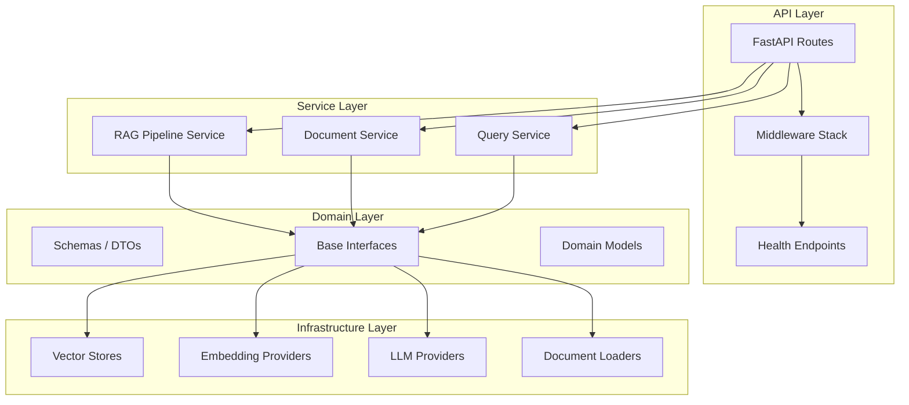
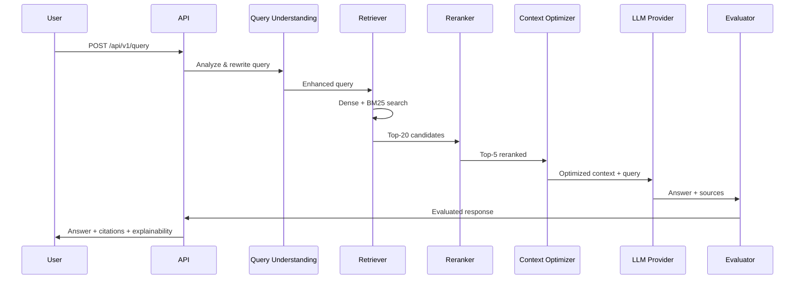
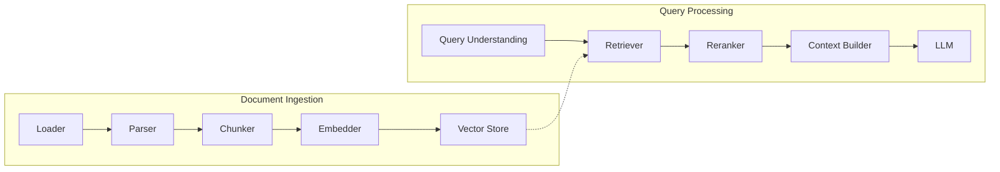

# Enterprise RAG OS — System Architecture

## Overview

Enterprise RAG OS is a production-grade Retrieval-Augmented Generation platform
designed for enterprise environments. It follows Clean Architecture principles
with a clear separation between API, service, domain, and infrastructure layers.

## High-Level Architecture

## RAG Pipeline Flow

## Component Interaction

## Technology Stack

| Component | Technology | Rationale |
|-----------|-----------|-----------|
| Web Framework | FastAPI | Async-native, auto-docs, Pydantic integration |
| Configuration | Pydantic Settings | Type-safe, validated, .env support |
| Logging | structlog | Structured JSON logs, correlation IDs |
| Testing | pytest + httpx | Async support, coverage, fixtures |
| Linting | ruff | Fast, comprehensive, Python-native |
| Type Checking | mypy | Strict type safety |
| Containerization | Docker | Reproducible builds, CI/CD |

## Security Architecture

- JWT-based authentication (Phase 6)
- Role-based access control (Phase 6)
- Input validation via Pydantic (all phases)
- Rate limiting (Phase 6)
- Prompt injection protection (Phase 6)
- Non-root Docker user (Phase 1)
- Secrets via environment variables (Phase 1)
